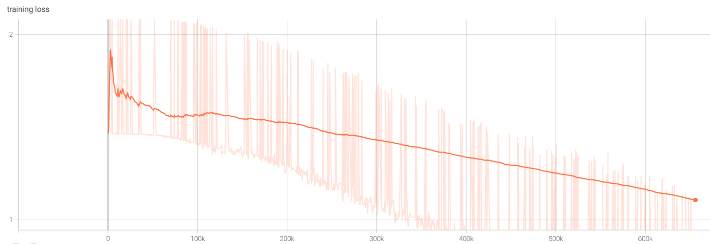

# Encoder-decoder architecture

Example of creating custom encoder-decoder architecture for predicting next word using pytroch.

## Requirements

Have to be installed **python 3.9**. Install required libraries using requirements.txt and pip.

## Training 

Model trained on 1000 epochs, Intel Core i5 2.40Ghz CPU. For training data used first chapter of Harry Potter book.

## Results

## Further improvements

For further improvements we can collect more text, train longer, tune hyperparameters, update model architecture and use more computer power.

## Useful resources

[1] https://medium.com/analytics-vidhya/encoder-decoder-seq2seq-models-clearly-explained-c34186fbf49b
[2] https://pytorch.org/docs/stable/generated/torch.nn.LSTM.html
[3] https://pytorch.org/tutorials/intermediate/seq2seq_translation_tutorial.html
[4] https://github.com/bentrevett/pytorch-seq2seq/blob/master/1%20-%20Sequence%20to%20Sequence%20Learning%20with%20Neural%20Networks.ipynb
[5] https://d2l.ai/chapter_recurrent-modern/seq2seq.html
[6] https://github.com/astorfi/sequence-to-sequence-from-scratch

